# JX HV5932MG Servo Teardown


Specs:

8.4V
32.3 kg cm stall
5.25 A stall
.1 seconds/60 degrees free running (100 rpm)
.23 A free running


| Speed (RPM) | Torque (N-m) | Torque (in-lbf) | Current (A) | Pout (W) | Efficiency | Pin (W) | Heat (W) | back-EMF (V) |
|---|---|---|---|---|---|---|---|---|
| 0 | 3.16 | 27.98 | 5.25 | 0.00 | 0.00 | 44.10 | 44.10 | 0.00 |
| 7 | 2.94 | 26.02 | 4.90 | 2.15 | 5.24 | 41.15 | 38.99 | 0.56 |
| 13 | 2.75 | 24.34 | 4.60 | 3.74 | 9.69 | 38.62 | 34.87 | 1.04 |
| 20 | 2.53 | 22.38 | 4.25 | 5.30 | 14.85 | 35.67 | 30.37 | 1.61 |
| 27 | 2.31 | 20.42 | 3.89 | 6.52 | 19.94 | 32.71 | 26.19 | 2.17 |
| 33 | 2.12 | 18.74 | 3.59 | 7.32 | 24.24 | 30.18 | 22.87 | 2.65 |
| 40 | 1.90 | 16.79 | 3.24 | 7.94 | 29.17 | 27.23 | 19.29 | 3.21 |
| 47 | 1.68 | 14.83 | 2.89 | 8.24 | 33.96 | 24.28 | 16.04 | 3.78 |
| 53 | 1.49 | 13.15 | 2.59 | 8.24 | 37.90 | 21.75 | 13.51 | 4.26 |
| 60 | 1.26 | 11.19 | 2.24 | 7.94 | 42.25 | 18.80 | 10.86 | 4.82 |
| 67 | 1.04 | 9.23 | 1.89 | 7.32 | 46.18 | 15.85 | 8.53 | 5.38 |
| 73 | 0.85 | 7.55 | 1.59 | 6.52 | 48.99 | 13.32 | 6.79 | 5.86 |
| 80 | 0.63 | 5.60 | 1.23 | 5.30 | 51.09 | 10.37 | 5.07 | 6.43 |
| 87 | 0.41 | 3.64 | 0.88 | 3.74 | 50.49 | 7.41 | 3.67 | 6.99 |
| 93 | 0.22 | 1.96 | 0.58 | 2.15 | 44.12 | 4.88 | 2.73 | 7.47 |
| 100 | 0.00 | 0.00 | 0.23 | 0.00 | 0.00 | 1.93 | 1.93 | 8.03 |


Reverse engineer report for JX HV5932MG-360 servo

## Enclosure

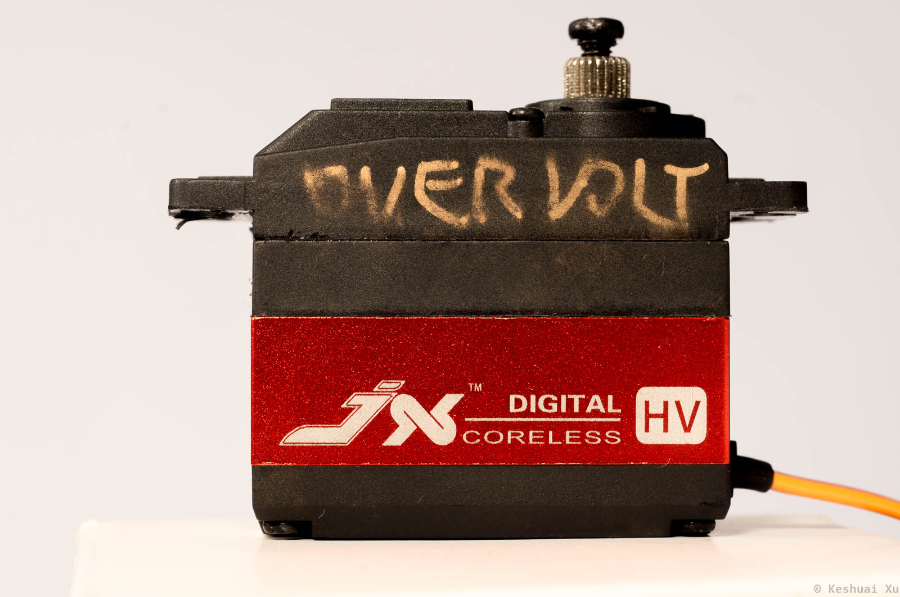

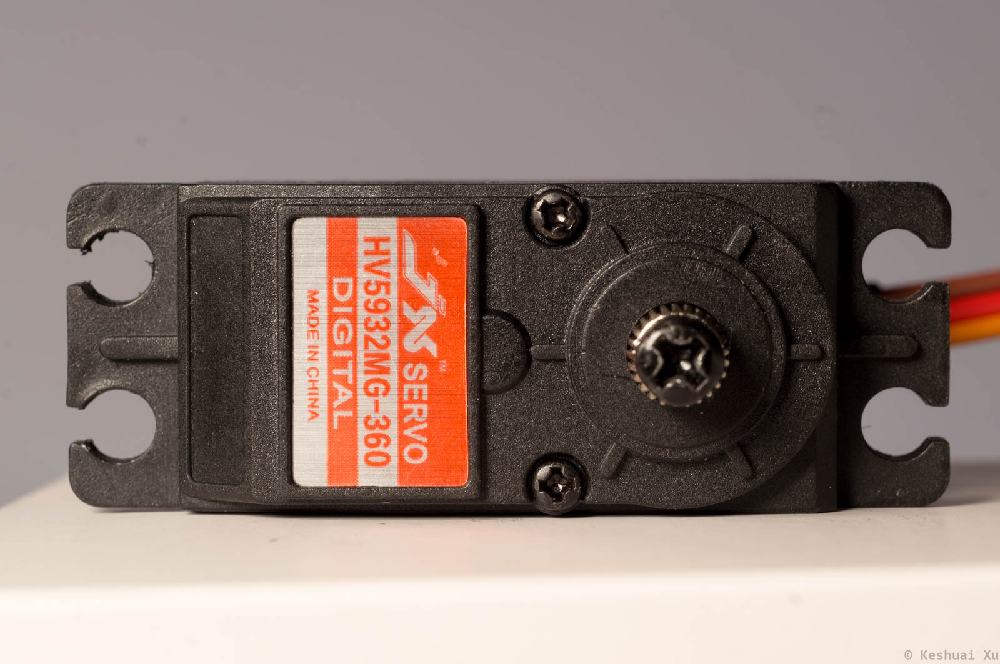

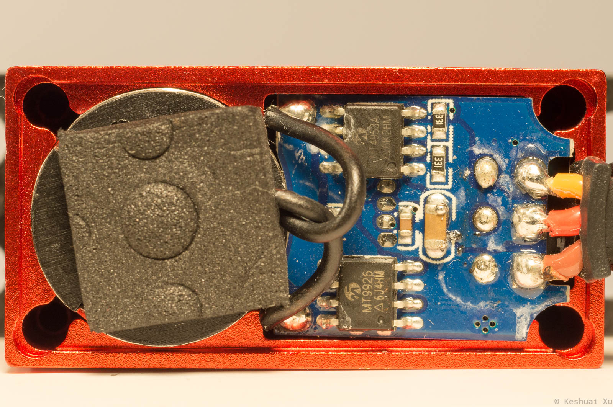

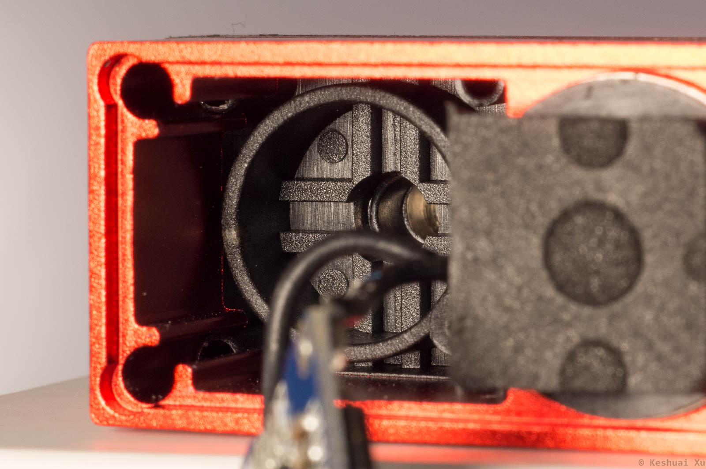

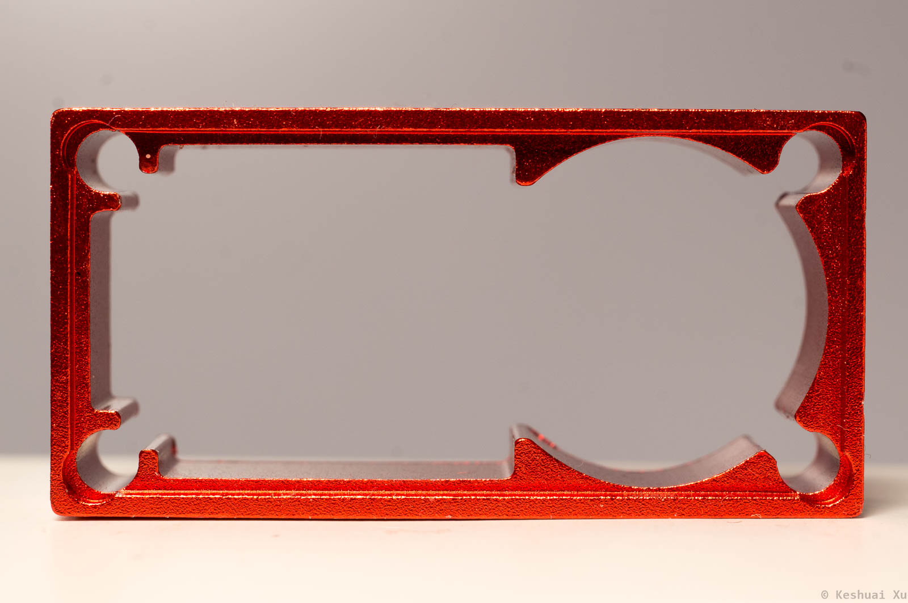

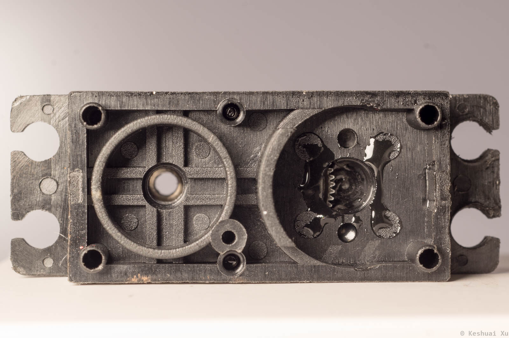

### Review

Pro

- Look and feel is good

Con

- Poor thermal conductivity between extruded aluminum casing and the motor. Can be improved by adding thermal paste.
- No brass inserts for the screws. Screw hole threads strip after a couple disassembly cycles.

## Controller

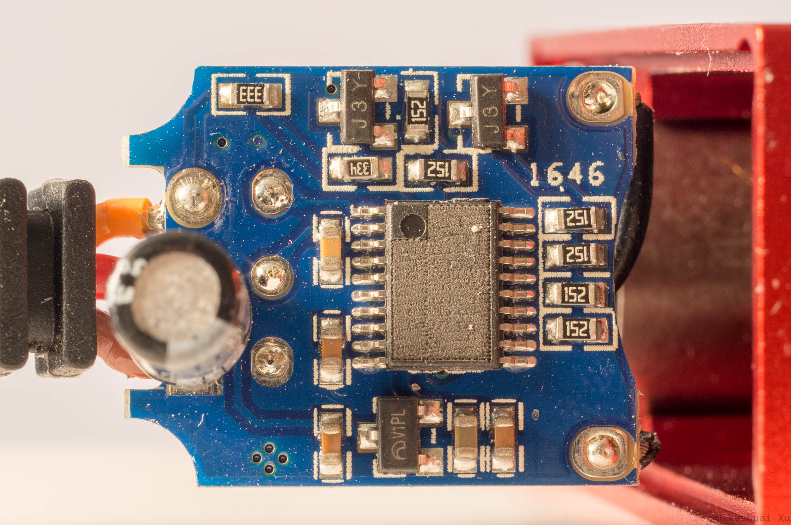

Servo controller chip marking is lasered off. ~~Suspect a variant of `MAC900` servo ASIC. MAC900 requires an external crystal and uses a different pin for PWM input.~~ The same board is used in both servo and continuous rotation motor models. There are some contact pads on the other side of the board, possibly for programming/configuration.

The controller is likely a `STM8s` 8-bit microcontroller based on the pinouts. The pads on the back are SWIM. The pinout below is in the same orientation as the next figure. ST-Link can be used to reprogram the chip.

```
SWIM
Reset
Vcc
GND
```

**`J3Y`** `S8050` NPN transistors. Ic = 0.5 A. Vce_max = 25 V. They are possibly gate drivers.

**`V1PL`** no information found. Likely an LDO. This board has been overvoltaged to 30 V and there is a short to ground after the LDO.

Input bulk capacitor rated for 16 V 100 uF.

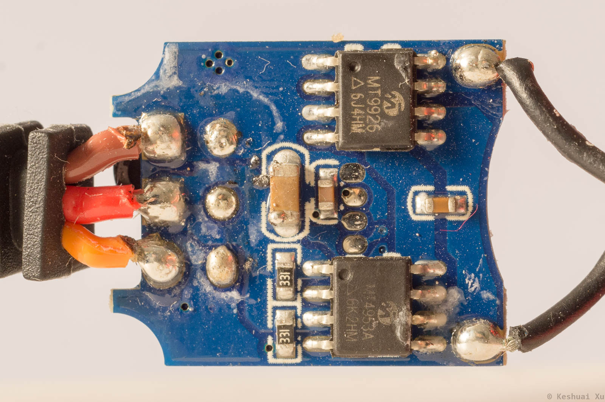

**`MT4953A`** dual P-channel MOSFET. Id = -5 A. Vds = -20 V. Rds_on = 84 mOhm @ 4.5 V.

**`MT9926`** dual N-channel MOSFET. Id = 6 A. Vds = 20 V. Rds_on = 22 mOhm @ 4.5 V.

### Review

Pro

- H-bridge is strong with adequate headroom.
- PCB is compact and well-designed.

Con

- Hand soldering quality is poor.
- Lasering off chip marking reveals insecurity.
- Motor PWM frequency is probably low (~400 Hz).


## Motor

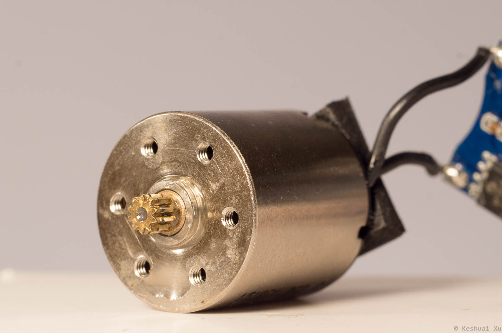

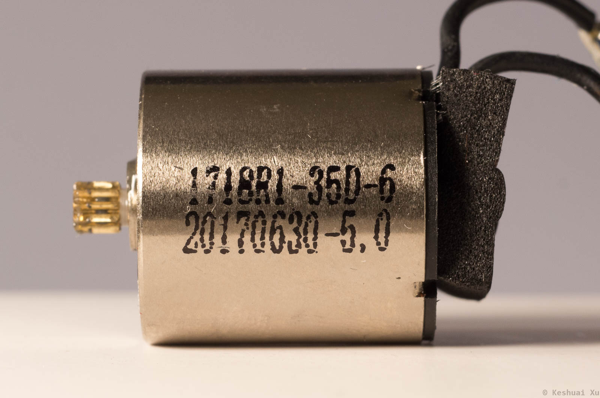

It is verified to be a coreless motor. The casing is machined. Terminal resistance: 1.13 Ohm.

Motor marking:

```
1718R1-350-6
20170630-5,0
```

Suspected manufacturer: [Sinbad Motor](http://www.sinbad-motor.com/prod_view.aspx?TypeId=27&Id=175&FId=t3:27:3), a Chinese motor manufacturer that makes drop-in Maxon replacements. They seem to offer maxon-style customization. I couldn't find a datasheet on the their website. The product page says the maximum efficiency is 85% (I don't believe it). The retail price of the motor is about $10 - $15.

### Review

Pro

- The look and feel of the motor are excellent. 

Con

- Brass bushing instead of ball bearings for the shaft.

## Gearbox

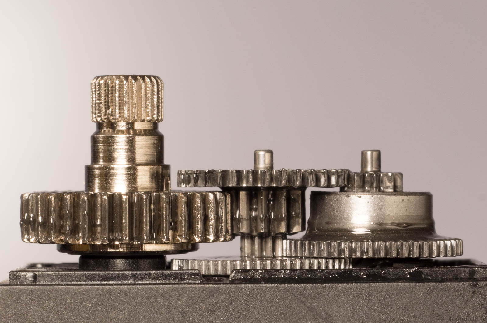

```
Stage 1: Aluminum
Stage 2 and 3: Carbon Steel
Stage 4: Stainless Steel
```

Lubricant contains large number of metal particles.

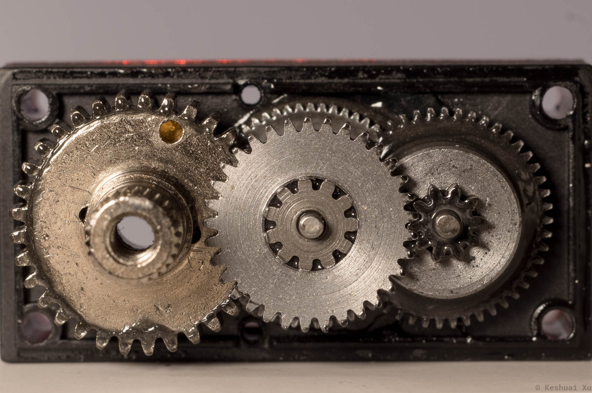

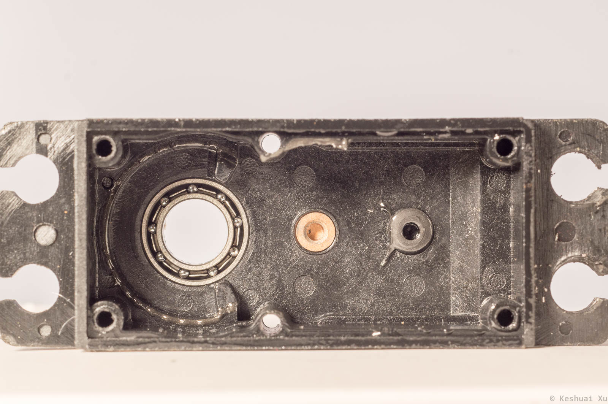

### Review

Pro

- Expensive output shaft material and process.
- Good backlash performance for the price.

Con

- Metal particles in the lube.
- Gearbox is not as smooth as I would like.
